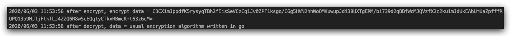
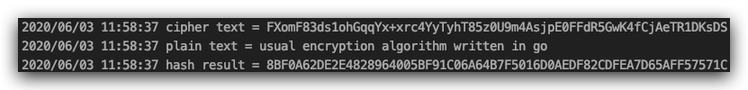

# [secret](https://github.com/pyihe/secret)
usual encryption algorithm written in go

#### Function
##### Cipher
|Name|BlockMode|Padding|
|:---|:----------|:------|
|DES |CBC/ECB/CFB/OFB/CTR |PKCS#5/PKCS#7/Zero/None|
|3DES|CBC/ECB/CFB/OFB/CTR|PKCS#5/PKCS#7/Zero/None|
|AES |CBC/ECB/CFB/OFB/CTR|PKCS#5/PKCS#7/Zero/None|
|RC4 |-|-|
|RSA|Encrypt/Decrypt/Sign/Verify|-|

##### Hash  
|Name|
|:---|
|Hash|
|DoubleHash|

##### Sign&&Verify
|Name|Description|
|:---|:----------|
|ECC(ECDSA) |Sign/Verify|
|DSA|Sign/Verify|


#### Example
```go
//RSA encrypt, decrypt
var data  = "usual encryption algorithm written in go"
var label = []byte("label")
c := secret.NewCipher()
//if GenerateRSAKey is not called, then you must call SetRSAKey to set yourself private key.
//SetRSAKey is not necessary if GenerateRSAKey is called.
//c.SetRSAKey("your privateKey file", secret.PKCSLevel1)
_, _, err := c.GenerateRSAKey(1024, "conf", secret.PKCSLevel1)
if err != nil {
    log.Fatalf("exit with generate key err: %v\n", err)
}
encryptData, err := c.RSAEncryptString(data, secret.RSAEncryptTypeOAEP, label)
if err != nil {
    log.Fatalf("exit with encrypt err: %v\n", err)
}
log.Printf("after encrypt, encrypt data = %s\n", encryptData)
originalData, err := c.RSADecryptString(encryptData, secret.RSAEncryptTypeOAEP, label)
if err != nil {
    log.Fatalf("exit with decrypt err: %v\n", err)
}
log.Printf("after decrypt, data = %s\n", originalData)
```
run result:




```go
//AES encrypt, decrypt
data = "usual encryption algorithm written in go"
key  = "1234567812345678"
s := secret.NewCipher()
cipherText, err := s.SymEncryptString(data, key, secret.SymTypeAES, secret.BlockModeECB, secret.PaddingTypeZeros)
if err != nil {
    log.Fatalf("exit in SymEncryptString with err: %v\n", err)
}
log.Printf("cipher text = %s\n", cipherText)
plainText, err := s.SymDecryptString(cipherText, key, secret.SymTypeAES, secret.BlockModeECB, secret.PaddingTypeZeros)
if err != nil {
    log.Fatalf("exit in SymDecryptString with err: %v\n", err)
}
log.Printf("plain text = %s\n", plainText)

//hash
h := secret.NewHasher()
hashString, err := h.HashToString(data, crypto.SHA256)
if err != nil {
    log.Fatalf("exit with HashToString err: %v\n", err)
}
log.Printf("hash result = %v\n", hashString)
```
run result: 

